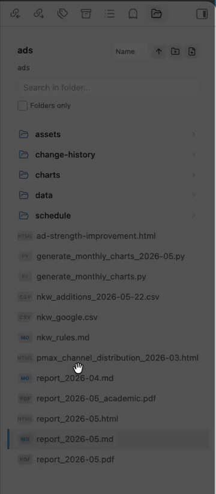
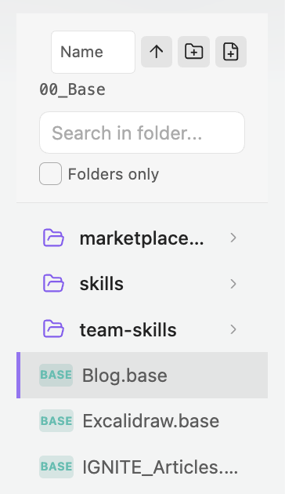
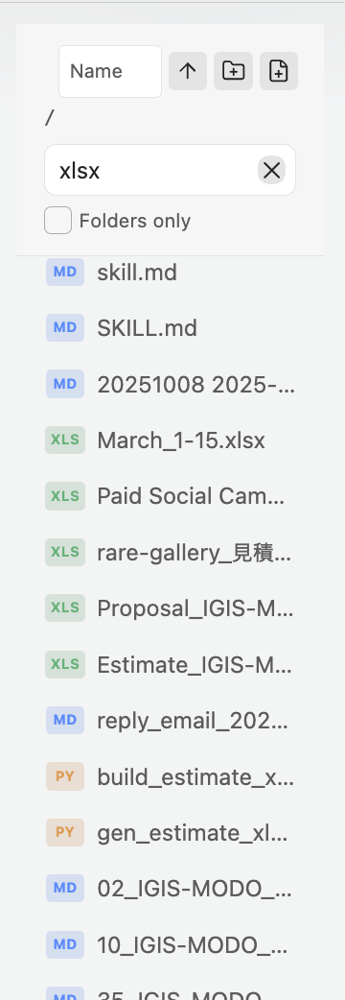

# Folder Focus

A Finder-like folder navigation view for [Obsidian](https://obsidian.md).

## Screenshots



| Folder view | Search and file badges |
|-------------|------------------------|
|  |  |

## Features

### Navigation
- **Focused folder view** in the right sidebar
- **Finder-compatible keyboard shortcuts**
- **Selection history** - remembers your position when navigating back
- **Favorite folders** - pin folders and jump back to them from the header
- **Live refresh** - automatically updates when files change externally (e.g., in Finder)

### File Operations
- **Multi-selection** - Cmd+Click to toggle, Shift+Click for range selection
- **Context menu** - right-click for file operations
- **New folder/note buttons** - quick creation from the header
- **Rename/Delete folders** - directly from context menu
- **Create folder with selection** - group selected items into a new folder
- **Move items between folders** - drag selected items onto a folder row
- **Import from Finder** - drag external files or folders into the current folder or a folder row
- **Clear drag feedback** - valid, invalid, and import drop targets are shown while dragging

### Search
- **Search mode toggle** - switch between file-name search and file names plus Markdown note text
- **Subfolder search** - includes all nested files
- **Folders only filter** - toggle to show only folders
- **Highlighted matches** - matching file and folder name text is highlighted in results
- **Clear button** - quickly reset search
- **IME-safe search shortcuts** - composition Enter/Escape events do not accidentally run or clear searches

### Opening Files
- **Single click** - select item
- **Double click** - open file or enter folder
- **Cmd+Double click** - open file in new tab
- **Cmd+Enter** - open selected file in new tab

### File Type Badges
- Compact badges for Markdown, Obsidian Canvas, Obsidian Base, documents, spreadsheets, presentations, PDFs, images, code, JSON, text, diagrams, ebooks, databases, design files, fonts, configs, notebooks, archives, audio, and video files

## Supported File Types

Folder Focus can show compact badges for these file extensions:

| Type | Extensions |
|------|------------|
| Markdown | `md`, `markdown` |
| Obsidian | `canvas`, `base` |
| Text | `txt`, `rtf` |
| Documents | `doc`, `docx`, `pages`, `odt`, `gdoc` |
| Presentations | `ppt`, `pptx`, `pptm`, `pps`, `ppsx`, `key`, `keynote`, `odp`, `gslides` |
| Spreadsheets | `xls`, `xlsx`, `xlsm`, `xlsb`, `numbers`, `ods`, `gsheet`, `csv`, `tsv` |
| PDF | `pdf` |
| Images | `png`, `jpg`, `jpeg`, `gif`, `webp`, `svg`, `bmp`, `avif`, `heic` |
| Design | `fig`, `sketch`, `psd`, `psb`, `ai`, `eps`, `xd`, `afdesign` |
| Diagrams | `drawio`, `diagram`, `mmd`, `mermaid`, `excalidraw` |
| Ebooks | `epub`, `mobi`, `azw`, `azw3` |
| Databases | `db`, `sqlite`, `sqlite3` |
| Fonts | `ttf`, `otf`, `woff`, `woff2` |
| Data and config | `json`, `toml`, `ini`, `env` |
| Notebooks | `ipynb` |
| Code | `js`, `ts`, `jsx`, `tsx`, `css`, `scss`, `html`, `xml`, `yaml`, `yml`, `sh`, `bash`, `zsh`, `go`, `rs`, `java`, `kt`, `swift`, `c`, `h`, `cpp`, `hpp`, `cs`, `php`, `rb`, `py`, `pyw` |
| Archives | `zip`, `7z`, `rar`, `tar`, `gz` |
| Audio | `mp3`, `wav`, `m4a`, `flac`, `ogg` |
| Video | `mp4`, `mov`, `mkv`, `webm`, `avi` |

Other files still appear in the list with a generic file badge.

### Sorting
- Sort by **name**, **modified date**, or **created date**
- Toggle **ascending/descending** order

## Installation

### From Obsidian Community Plugins

Folder Focus is listed in Obsidian Community Plugins. Obsidian currently marks it as not manually reviewed by Obsidian staff.

1. Open Obsidian Settings
2. Go to Community plugins
3. Click Browse and search for "Folder Focus"
4. Install and enable the plugin

### Manual Installation

1. Download `main.js`, `manifest.json`, and `styles.css` from the [latest release](https://github.com/1spread/obsidian-folder-focus/releases/latest)
2. Create a folder `obsidian-folder-focus` in your vault's `.obsidian/plugins/` directory
3. Copy the downloaded files into this folder
4. Reload Obsidian and enable the plugin in Settings → Community plugins

## Usage

### Opening Folder Focus

- Click the **folder icon** in the left ribbon
- Right-click any folder → **"Open in folder focus"**
- Use command palette: **"Open folder navigation view"**

### Keyboard Shortcuts

| Shortcut | Action |
|----------|--------|
| `↑` / `↓` | Move selection up/down |
| `Shift+↑` / `Shift+↓` | Extend selection up/down |
| `⌘+A` / `Ctrl+A` | Select all |
| `⌘+↑` / `Ctrl+↑` | Navigate to parent folder |
| `⌘+↓` / `Ctrl+↓` | Enter folder or open file |
| `Enter` | Enter folder or open file |
| `⌘+Enter` / `Ctrl+Enter` | Open file in new tab |
| `⇧⌘+N` / `Ctrl+Shift+N` | Create new note |
| `Escape` | Clear search / Collapse selection |

### Mouse Actions

| Action | Result |
|--------|--------|
| Single click | Select item |
| Cmd/Ctrl + Click | Toggle selection (multi-select) |
| Shift + Click | Range selection |
| Double click | Enter folder or open file |
| Cmd/Ctrl + Double click | Open file in new tab |
| Right click | Context menu |
| Drag selected items onto a folder | Move selected items into that folder |
| Drag Finder files/folders into the view | Import them into the vault folder |

### Context Menu Options

- **Rename folder** - rename the selected folder
- **Delete folder** - move folder to trash
- **Add/Remove from favorites** - pin or unpin a folder
- **Create folder with selection** - create new folder with selected items
- Standard Obsidian file menu options

### Search

1. Type in the search box and press **Enter** to search
2. Search includes:
   - File and folder names
   - File content (markdown files)
   - All subfolders recursively
3. Toggle **"Folders only"** to filter results
4. Click **×** or press **Escape** to clear search

### Commands

All commands are available via the command palette (`⌘+P` / `Ctrl+P`):

- **Open folder navigation view** - Opens the folder navigation panel
- **Reveal active file** - Shows the current file in the navigation view
- **Navigate to parent folder** - Go up one level
- **Enter folder or open file** - Enter selected folder or open selected file
- **Create new note in current folder** - Creates a new note

## Settings

- **Open files in new tab** - When enabled, files open in a new tab instead of the current one

## Releases

- Current version: `1.1.2`
- Minimum Obsidian version: `1.13.0`
- Release downloads: [GitHub Releases](https://github.com/1spread/obsidian-folder-focus/releases/latest)
- Full history: [CHANGELOG.md](CHANGELOG.md)

## Development

```bash
# Clone the repository
git clone https://github.com/1spread/obsidian-folder-focus.git
cd obsidian-folder-focus

# Install dependencies
npm install

# Build for development (with watch mode)
npm run dev

# Build for production
npm run build
```

## Support

If you find this plugin helpful, consider supporting its development:

[Buy me a coffee](https://buymeacoffee.com/1spread)

## License

MIT License - see [LICENSE](LICENSE) for details.
